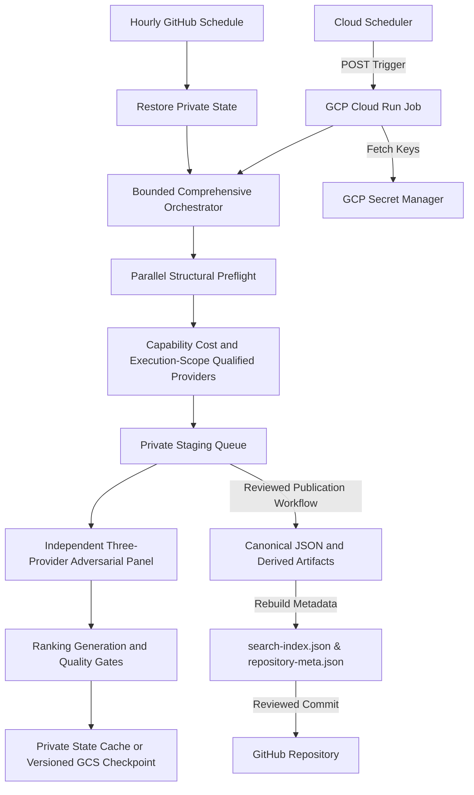

# Venture Atlas OS — System Architecture Blueprint

## Overview

Venture Atlas OS is an autonomous venture research platform and static business intelligence atlas. It operates as a decoupled two-plane system:

1. **Static Presentation Plane (GitHub Pages / PWA / Edge CDN):**
   - High-performance static site serving 324 canonical ideas, 432 dossiers, 4,625 prompt records, and interactive analysis tools.
   - PWA Service Worker (`sw.js`) providing offline capability with versioned cache invalidation.

2. **Configured Cloud Control Plane (GCP Cloud Run Jobs / Cloud Scheduler / Secret Manager / Firestore):**
   - Source-level infrastructure contract for off-device scheduled work; deployment, IAM reachability, secret versions, and a successful remote execution have not been observed.
   - 9-provider registry (`nvidia-nim`, `cohere-api`, `omniRoute`, `fcc-claude`, `active-api`, `deepseek-api`, `anthropic-full`, `hermes-ollama`, `own-orch`) with key pools and circuit-breaker backoff where configured.

## Core Components

- **Data Store:** Single source of truth in `data/ideas.json`, governed by `data/ideas.schema.json`.
- **Normalized Browsing Taxonomy:** `data/idea-taxonomy.json` deterministically maps every canonical record to a market family, venture pattern, buyer segment, similarity group, and nearest neighbors. It preserves original categories and cannot merge records or establish identity, ranking, or validation claims.
- **Derived Metadata:** `data/repository-meta.json` generated deterministically.
- **Search Engine:** Client-side in-memory index `data/search-index.json` includes normalized family, pattern, and buyer fields and is loaded asynchronously by `assets/js/site.js`.
- **Bounded Pipeline:** `scripts/va-massive-orchestrator.py` runs a parallel read-only preflight, provider health, bounded discovery, candidate-ID migration, independent provider cross-check, ranking, generation, and source-quality verification with dependency-aware failure propagation.
- **Independent Model Panel:** `scripts/va-research-crosscheck.py` requires three distinct external model responses in strict cloud mode. Panel output is private review telemetry and is never promoted to primary-source evidence.
- **Execution-Scope Routing:** cloud runs can use configured API providers and deterministic orchestration; laptop-local Hermes is excluded. Hermes requires a separately authenticated always-on runtime before it can participate while the workstation is off.
- **Durable Recurrence:** the GitHub workflow restores and saves the private staging queue on an hourly schedule. The GCP job resolves a configured branch to one immutable SHA per run and permits checkpoint migration only along verified Git ancestry.
- **Backlog Authority:** `.agent-system/backlog.json` owns live work status. `data/agent-task-graph.json` is a non-authoritative `CAP-*` capability plan.
