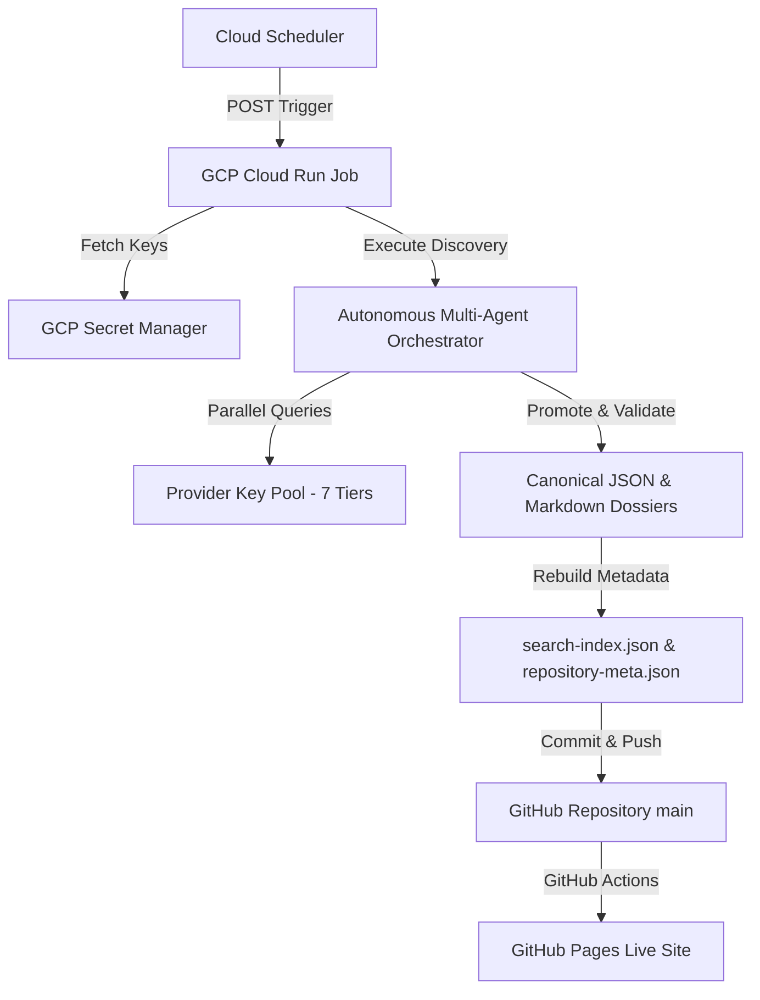

# Venture Atlas OS — System Architecture Blueprint

## Overview

Venture Atlas OS is an autonomous venture research platform and static business intelligence atlas. It operates as a decoupled two-plane system:

1. **Static Presentation Plane (GitHub Pages / PWA / Edge CDN):**
   - High-performance, zero-cost static site serving 468+ canonical & staged startup dossiers, 4,425+ generated prompt packs, and interactive analysis tools.
   - PWA Service Worker (`sw.js`) providing offline capability with versioned cache invalidation.

2. **Durable Cloud Control Plane (GCP Cloud Run Jobs / Cloud Scheduler / Secret Manager / Firestore):**
   - Unattended 24/7 autonomous worker execution independent of developer hardware or active IDE sessions.
   - 7-tier provider key rotation (`omniRoute`, `fcc-claude`, `active-api`, `deepseek-api`, `anthropic-full`, `hermes-ollama`, `own-orch`) with circuit breaker backoff.

## Core Components

- **Data Store:** Single source of truth in `data/ideas.json`, governed by `data/ideas.schema.json`.
- **Derived Metadata:** `data/repository-meta.json` generated deterministically.
- **Search Engine:** Client-side in-memory index `data/search-index.json` loaded asynchronously by `assets/js/site.js`.
- **Multi-Agent Engine:** Multi-threaded domain discovery in `scripts/autonomous-idea-generator.py` coupled with `scripts/va_orchestrator.py`.
